# 🤖 Takeshi Bot

<div align="center">
    
</div>

<br />

<div align="center">
    <a href="https://github.com/guiireal/takeshi-bot">
        
    </a>
</div>

<br />

> Base para bots de WhatsApp multifuncional com diversos comandos prontos.

[](https://nodejs.org/en)
[](https://axios-http.com/ptbr/docs/intro)
[](https://github.com/WhiskeySockets/Baileys)
[](https://ffmpeg.org/)
[](https://api.spiderx.com.br)

## Desenvolvida do zero, no vídeo:

[CRIANDO UM BOT DE WHATSAPP DO ZERO (GUIA DEFINITIVO) - BASE COMPLETA + 6 COMANDOS - JAVASCRIPT](https://youtu.be/6zr2NYIYIyc)

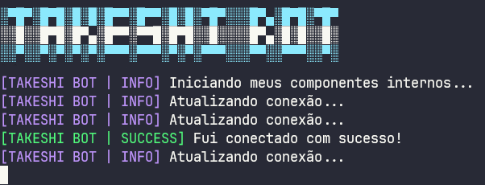

## 📋 Sumário

1. [Idiomas disponíveis](#-acesse-o-takeshi-bot-em-outros-idiomas)
2. [Atenção - suporte](#-atenção)
3. [Sobre o projeto](#sobre-este-projeto)
4. [Instalação](#instalação)
   - [Instalação no Termux](#instalação-no-termux)
   - [Instalação nas principais hosts do Brasil](#instalação-nas-principais-hosts-do-brasil)
   - [Instalação em VPS (Debian/Ubuntu)](#instalação-em-vps-debianubuntu)
5. [Configuração de API](#alguns-comandos-necessitam-de-api)
6. [Funcionalidades](#funcionalidades)
   - [Funcionalidades gerais](#funcionalidades-gerais)
   - [Funcionalidades de envio](#funcionalidades-de-envio-exemplos)
7. [Auto responder](#auto-responder)
8. [Personalização](#personalização)
    - [Menu do bot](#onde-fica-o-menu-do-bot)
    - [Mensagens de boas vindas](#onde-modifico-a-mensagem-de-boas-vindas-e-quando-alguém-sai-do-grupo)
9. [Implementação técnica](#implementação-técnica-dos-exemplos)
10. [Estrutura de pastas](#estrutura-de-pastas)
11. [Erros comuns](#erros-comuns)
12. [Canal do YouTube](#inscreva-se-no-canal)
13. [Contribuindo com o projeto](#contribuindo-com-o-projeto)
14. [Licença](#licença)
15. [Disclaimer](#-disclaimer)

## 🌐 Acesse o Takeshi Bot em outros idiomas

<ul style="list-style: none; padding-left: 0;">
  <li>
    
    <strong>English</strong> — <a href="https://github.com/guiireal/takeshi-bot-english">click here</a>
  </li>
  <li>
    
    <strong>Español</strong> — <a href="https://github.com/guiireal/takeshi-bot-espanol">haz clic aquí</a>
  </li>
  <li>
    
    <strong>Bahasa Indonesia</strong> — <a href="https://github.com/guiireal/takeshi-bot-bahasa-indonesia">klik disini</a>
  </li>
</ul>

## ⚠ Atenção

Nós não prestamos suporte gratuíto caso você tenha adquirido esta base com terceiros e tenha pago por isso. 
Solicite que **a pessoa que te vendeu, forneça suporte**.
Nós não temos vínculo nenhum com terceiros e não nos responsabilizamos por isso, nem prestamos suporte nessas condições.

## Sobre este projeto

Este projeto não possui qualquer vínculo oficial com o WhatsApp. Ele foi desenvolvido de forma independente para interações automatizadas por meio da plataforma.

Não nos responsabilizamos por qualquer uso indevido deste bot. É de responsabilidade exclusiva do usuário garantir que sua utilização esteja em conformidade com os termos de uso do WhatsApp e a legislação vigente.

## Instalação no Termux

1 - Abra o Termux e execute os comandos abaixo.<br/>
_Não tem o Termux? [Clique aqui e baixe a última versão](https://www.mediafire.com/file/wxpygdb9bcb5npb/Termux_0.118.3_Dev_Gui.apk) ou [clique aqui e baixe versão da Play Store](https://play.google.com/store/apps/details?id=com.termux) caso a versão do MediaFire anterior não funcione._

```sh
pkg upgrade -y && pkg update -y && pkg install git -y && pkg install nodejs-lts -y && pkg install ffmpeg -y
```

2 - Habilite o acesso da pasta storage, no termux.

```sh
termux-setup-storage
```

3 - Escolha uma pasta de sua preferência pra colocar os arquivos do bot.

Pastas mais utilizadas:

- /sdcard
- /storage/emulated/0
- /storage/emulated/0/Download (muito comum quando você baixa o bot pelo .zip)

No nosso exemplo, vamos para a `/sdcard`
```sh
cd /sdcard
```

4 - Clone o repositório.

```sh
git clone https://github.com/guiireal/takeshi-bot.git
```

5 - Entre na pasta que foi clonada.

```sh
cd takeshi-bot
```

6 - Habilite permissões de leitura e escrita (faça apenas 1x esse passo).

```sh
chmod -R 755 ./*
```

7 - Execute o bot.

```sh
npm start
```

8 - Insira o número de telefone e pressione `enter`.

9 - Informe o código que aparece no termux, no seu WhatsApp, [assista aqui, caso não encontre essa opção](https://youtu.be/6zr2NYIYIyc?t=5395).

10 - Aguarde 10 segundos, depois digite `CTRL + C` para parar o bot.

11 - Configure o arquivo `config.js` que está dentro da pasta `src`.

```js
// Prefixo dos comandos
exports.PREFIX = "/";

// Emoji do bot (mude se preferir).
exports.BOT_EMOJI = "🤖";

// Nome do bot (mude se preferir).
exports.BOT_NAME = "Takeshi Bot";

// Número do bot. Coloque o número do bot
// (apenas números, exatamente como está no WhatsApp).
// Se o seu DDD não for de SP ou do Rio, não coloque o 9 antes do número.
exports.BOT_NUMBER = "558112345678";

// Número do dono do bot. Coloque o número do dono do bot
// (apenas números, exatamente como está no WhatsApp).
// Se o seu DDD não for de SP ou do Rio, não coloque o 9 antes do número.
exports.OWNER_NUMBER = "5521950502020";

// LID do dono do bot.
// Para obter o LID do dono do bot, use o comando <prefixo>get-lid @marca ou +telefone do dono.
exports.OWNER_LID = "219999999999999@lid";
```

12 - Inicie o bot novamente.

```sh
npm start
```

## Instalação nas principais hosts do Brasil

As principais hosts já oferecem o Takeshi como **bot padrão**, não sendo necessário nenhuma instalação manual!

**Hosts suportadas**:

| Bronxys | Nexfuture |
|---------|-----------|
| [Grupo oficial](https://chat.whatsapp.com/J5OewHvweK1Kf7RGXAwIYM) | [Grupo oficial](https://chat.whatsapp.com/Fl5FzZQC00J5CZp07AZVwQ?mode=r_c) |
| [](https://bronxyshost.com/) | [](https://speedhosting.cloud/) |

| Speed Cloud | SpeedMaster |
|-------------| ------------ |
| [Grupo oficial](https://chat.whatsapp.com/HsZDn6DJrx34z5lbNbNB2M) | [Grupo oficial](https://chat.whatsapp.com/H48GLkKeh3YAWGQRSActa2?mode=ac_t) |
| [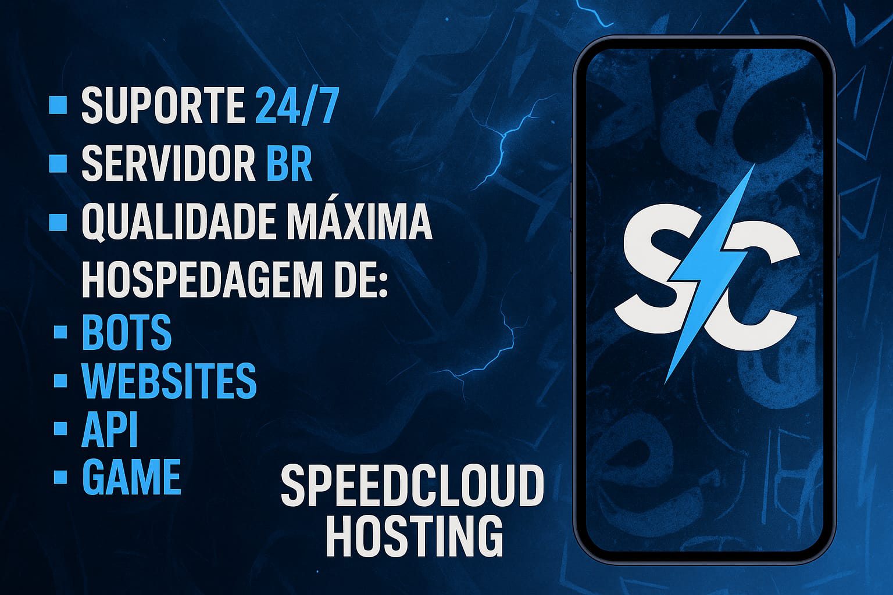](https://speedhosting.cloud/) | [](https://speedmasterx.shop/) |

## Instalação em VPS (Debian/Ubuntu)

1 - Abra um novo terminal e execute os seguintes comandos.

```sh
sudo apt update && sudo apt upgrade && sudo apt-get update && sudo apt-get upgrade && sudo apt install ffmpeg
```

2 - Instale o `curl` se não tiver.

```sh
sudo apt install curl
```

3 - Instale o `git` se não tiver.

```sh
sudo apt install git
```

4 - Instale o NVM.

```sh
curl -o- https://raw.githubusercontent.com/nvm-sh/nvm/v0.40.3/install.sh | bash
```

5 - Atualize o source do seu ambiente

```sh
source ~/.bashrc
```

6 - Instale a versão 22 mais recente do node.js.

```sh
nvm install 22
```

7 - Verifique se a versão foi instalada e está ativa.

```sh
node -v # Deve exibir a versão 22
```

8 - Verifique se o npm foi instalado junto.

```sh
npm -v # Deverá exibir a versão do npm
```

9 - Instale o PM2 (recomendado).

```sh
npm install pm2 -g
```

10 - Clone o repositório do bot onde você desejar.

```sh
git clone https://github.com/guiireal/takeshi-bot.git
```

11 - Entre na pasta clonada.

```sh
cd takeshi-bot
```

12 - Digite o seguinte comando.

```sh
npm start
```

13 - O bot vai solicitar que você digite seu número de telefone.<br/>
Digite **exatamente** como está no WhatsApp e apenas números.

Não adicione o 9º dígito em números que não sejam de SP ou RJ.

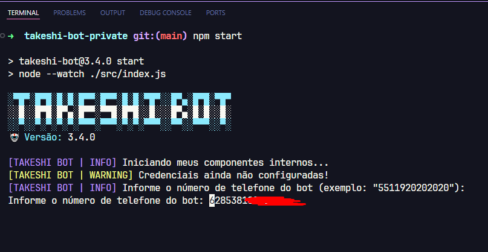

14 - Conecte o bot no PM2

```sh
pm2 start npm --name "takeshi-bot" -- start
```
15 - O bot exibirá um **código de pareamento** que deve ser colocado em `dispositivos conectados` no seu WhatsApp.

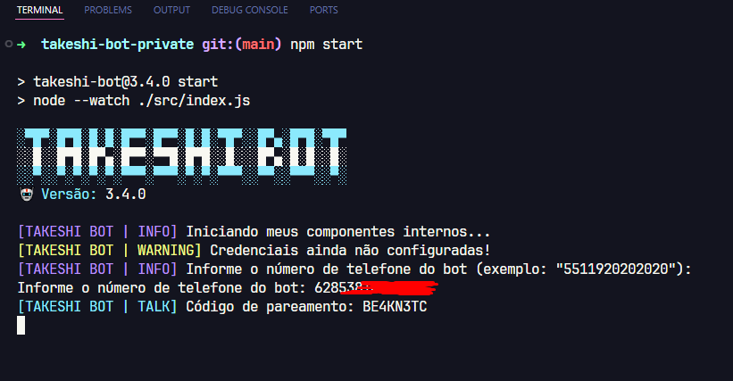

16 - Vá em `dispositivos conectados` no seu WhatsApp.

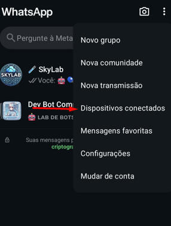

17 - Clique em `conectar dispositivo`

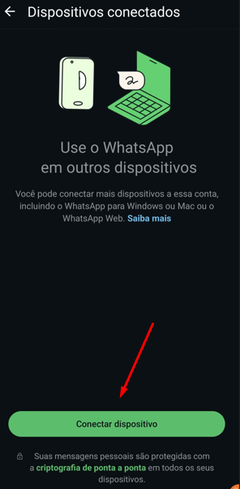

18 - No canto inferior, clique em `Conectar com número de telefone`


19 - Coloque o **código de pareamento** que você recebeu no terminal, que foi feito no passo `15`.

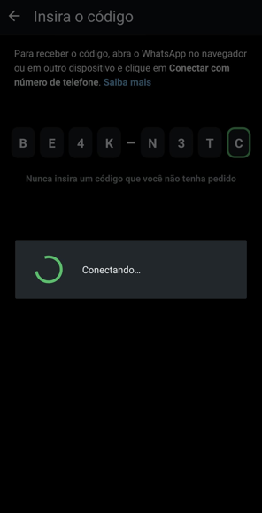

20 - Após isso, no terminal que ficou parado, ele deve exibir que **foi conectado com sucesso**

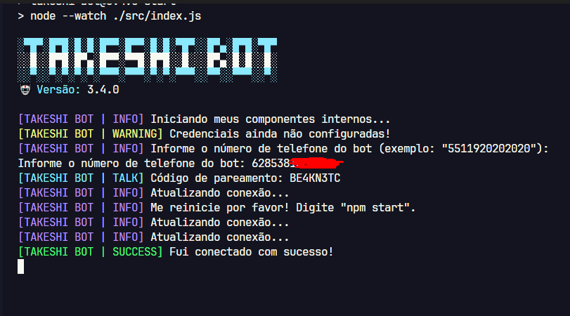

21 - Digite `CTRL + C` para parar o bot.

22 - Agora inicie ele pelo `PM2`, executando o seguinte código abaixo.

```sh
pm2 start npm --name "takeshi-bot" -- start
```

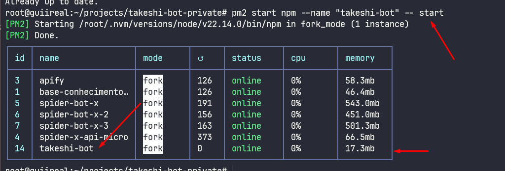

23 - Configure o arquivo `config.js` que está dentro da pasta `src`.

```js
// Prefixo dos comandos
exports.PREFIX = "/";

// Emoji do bot (mude se preferir).
exports.BOT_EMOJI = "🤖";

// Nome do bot (mude se preferir).
exports.BOT_NAME = "Takeshi Bot";

// Número do bot. Coloque o número do bot (apenas números).
exports.BOT_NUMBER = "5511920202020";

// Número do dono do bot. Coloque o número do dono do bot (apenas números).
exports.OWNER_NUMBER = "5511999999999";
```

24 - Por fim, teste o bot!

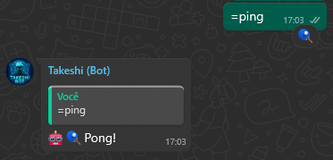

## Alguns comandos necessitam de API

Edite o arquivo `config.js` que está dentro da pasta `src` e cole sua api key da plataforma Spider X API, conforme o código abaixo.<br/>
Para obter seu token, acesse: [https://api.spiderx.com.br](https://api.spiderx.com.br) e crie sua conta gratuitamente!

```js
exports.SPIDER_API_TOKEN = "seu_token_aqui";
```

## Funcionalidades gerais

| Função | Contexto | Requer a Spider X API?
| ------------ | --- | ---
| Alterar imagem do bot | Dono | ❌
| Desligar o bot no grupo | Dono | ❌
| Executar comandos de infra | Dono | ❌
| Ligar o bot no grupo | Dono | ❌
| Obter o ID do grupo | Dono | ❌
| Abrir grupo | Admin | ❌
| Agendar mensagem | Admin | ❌
| Anti audio | Admin | ❌
| Anti documento | Admin | ❌
| Anti evento | Admin | ❌
| Anti imagem | Admin | ❌
| Anti link | Admin | ❌
| Anti produto | Admin | ❌
| Anti sticker | Admin | ❌
| Anti video | Admin | ❌
| Banir membros | Admin | ❌
| Excluir mensagens | Admin | ❌
| Fechar grupo | Admin | ❌
| Ligar/desligar auto responder | Admin | ❌
| Ligar/desligar boas vindas | Admin | ❌
| Ligar/desligar saída de grupo | Admin | ❌
| Limpar chat | Admin | ❌
| Marcar todos | Admin | ❌
| Mudar nome do grupo | Admin | ❌
| Mute/unmute | Admin | ❌
| Obter o link do grupo | Admin | ❌
| Revelar | Admin | ❌
| Somente admins | Admin | ❌
| Borrar imagem | Membro | ❌
| Busca CEP | Membro | ❌
| Canvas Bolsonaro | Membro | ✅
| Canvas cadeia | Membro | ✅
| Canvas inverter | Membro | ✅
| Canvas RIP | Membro | ✅
| Comandos de diversão/brincadeiras | Membro |❌
| Espelhar imagem | Membro | ❌
| Fake chat | Membro | ❌
| Figurinha de texto animada | Membro | ✅
| Geração de imagens com IA | Membro | ✅
| Gerar link | Membro | ❌
| Google Gemini | Membro | ✅
| Google search | Membro | ✅
| Imagem com contraste | Membro | ❌
| Imagem IA PixArt | Membro | ✅
| Imagem IA Stable Diffusion Turbo | Membro | ✅
| Imagem pixelada | Membro | ❌
| Imagem preto/branco | Membro | ❌
| Ping | Membro | ❌
| Play áudio | Membro | ✅
| Play vídeo | Membro | ✅
| Renomear figurinha | Membro | ❌
| Sticker | Membro | ❌
| Sticker IA  | Membro | ✅
| Sticker para imagem | Membro | ❌
| TikTok video download | Membro | ✅
| YT MP3 | Membro | ✅
| YT MP4 | Membro | ✅
| YT search | Membro | ✅

## Funcionalidades de envio (Exemplos)

### 🎵 Exemplos de áudio

| Comando | Função | Descrição | Características |
|---------|---------|-----------|-----------------|
| `/enviar-audio-de-arquivo` | Enviar áudio de arquivo | Demonstra envio de arquivos de áudio do armazenamento local | Opção de mensagem de voz, resposta citada |
| `/enviar-audio-de-url` | Enviar áudio de URL | Demonstra envio de arquivos de áudio de URLs externas | Opção de mensagem de voz, resposta citada |
| `/enviar-audio-de-buffer` | Enviar áudio de buffer | Demonstra envio de arquivos de áudio de buffers de memória | Opção de mensagem de voz, resposta citada, buffer de arquivo ou URL |

### 🖼️ Exemplos de imagem

| Comando | Função | Descrição | Características |
|---------|---------|-----------|-----------------|
| `/enviar-imagem-de-arquivo` | Enviar imagem de arquivo | Demonstra envio de arquivos de imagem do armazenamento local | Suporte a legenda personalizada, menções, resposta citada |
| `/enviar-imagem-de-url` | Enviar imagem de URL | Demonstra envio de arquivos de imagem de URLs externas | Envio direto de URL, suporte a menções, resposta citada |
| `/enviar-imagem-de-buffer` | Enviar imagem de buffer | Demonstra envio de arquivos de imagem de buffers de memória | Buffer de arquivo ou URL, legenda opcional, menções, resposta citada |

### 🎬 Exemplos de vídeo

| Comando | Função | Descrição | Características |
|---------|---------|-----------|-----------------|
| `/enviar-video-de-arquivo` | Enviar vídeo de arquivo | Demonstra envio de arquivos de vídeo do armazenamento local | Suporte a legenda personalizada, menções, resposta citada |
| `/enviar-video-de-url` | Enviar vídeo de URL | Demonstra envio de arquivos de vídeo de URLs externas | Envio direto de URL, suporte a menções, resposta citada |
| `/enviar-video-de-buffer` | Enviar vídeo de buffer | Demonstra envio de arquivos de vídeo de buffers de memória | Buffer de arquivo ou URL, legenda opcional, menções, resposta citada |

### 🎞️ Exemplos de GIF

| Comando | Função | Descrição | Características |
|---------|---------|-----------|-----------------|
| `/enviar-gif-de-arquivo` | Enviar GIF de arquivo | Demonstra envio de arquivos GIF do armazenamento local | Suporte a legenda, menções, resposta citada |
| `/enviar-gif-de-url` | Enviar GIF de URL | Demonstra envio de arquivos GIF de URLs externas | Suporte a legenda, menções, resposta citada |
| `/enviar-gif-de-buffer` | Enviar GIF de buffer | Demonstra envio de arquivos GIF de buffers de memória | Buffer de arquivo ou URL, legenda, menções, resposta citada |

### 🎭 Exemplos de sticker

| Comando | Função | Descrição | Características |
|---------|---------|-----------|-----------------|
| `/enviar-sticker-de-arquivo` | Enviar sticker de arquivo | Demonstra envio de arquivos sticker do armazenamento local | Formato WebP |
| `/enviar-sticker-de-url` | Enviar sticker de URL | Demonstra envio de arquivos sticker de URLs externas | Formato WebP |
| `/enviar-sticker-de-buffer` | Enviar sticker de buffer | Demonstra envio de arquivos sticker de buffers de memória | Buffer de arquivo ou URL |

### 📊 Exemplos de enquete/votação

| Comando | Função | Descrição | Características |
|---------|---------|-----------|-----------------|
| `/enviar-enquete` | Enviar enquete | Demonstra como criar e enviar enquetes/votações em grupos | Suporte a escolha única ou múltipla escolha |

### 📄 Exemplos de documento

| Comando | Função | Descrição | Características |
|---------|---------|-----------|-----------------|
| `/enviar-documento-de-arquivo` | Enviar documento de arquivo | Demonstra envio de arquivos de documento do armazenamento local | Especificação de tipo MIME, nome de arquivo personalizado |
| `/enviar-documento-de-url` | Enviar documento de URL | Demonstra envio de arquivos de documento de URLs externas | Especificação de tipo MIME, nome de arquivo personalizado |
| `/enviar-documento-de-buffer` | Enviar documento de buffer | Demonstra envio de arquivos de documento de buffers de memória | Buffer de arquivo ou URL, tipo MIME, nome de arquivo personalizado |

### 💬 Exemplos de mensagem

| Comando | Função | Descrição | Características |
|---------|---------|-----------|-----------------|
| `/enviar-texto` | Enviar texto | Demonstra envio de mensagens de texto simples | Suporte a menções |
| `/enviar-resposta` | Enviar resposta | Demonstra envio de mensagens de resposta | Respostas de sucesso/erro/aviso |
| `/enviar-reacoes` | Enviar reações | Demonstra envio de emojis de reação | Várias reações emoji, reações de sucesso/erro/aviso |

### 📊 Exemplos de metadados

| Comando | Função | Descrição | Características |
|---------|---------|-----------|-----------------|
| `/obter-metadados-mensagem` | Obter metadados da mensagem | Demonstra extração avançada de metadados de mensagem ou mensagem citada | Análise detalhada, suporte a resposta de mensagens, informações técnicas, menções automáticas |
| `/obter-dados-grupo` | Obter dados do grupo | Demonstra extração de informações do grupo | Metadados do grupo, lista de participantes, informações de admin |
| `/funcoes-grupo` | Funções do grupo | Demonstra uso de funções utilitárias do grupo | Extração de nome, dono, admins, participantes do grupo |

### 🎯 Central de exemplos

| Comando | Função | Descrição | Características |
|---------|---------|-----------|-----------------|
| `/exemplos-de-mensagens` | Central de exemplos | Central com lista de todos os exemplos disponíveis | Menu interativo, acesso direto a todos os exemplos |

## Auto responder

O Takeshi Bot possui um auto-responder embutido, edite o arquivo em `./database/auto-responder.json`:

```json
[
    {
        "match": "Oi",
        "answer": "Olá, tudo bem?"
    },
    {
        "match": "Tudo bem",
        "answer": "Estou bem, obrigado por perguntar"
    },
    {
        "match": "Qual seu nome",
        "answer": "Meu nome é Takeshi Bot"
    }
]
```

## Onde fica o menu do bot?

O menu do bot fica dentro da pasta `src` no arquivo chamado `menu.js`

## Onde modifico a mensagem de boas vindas e quando alguém sai do grupo?

As mensagens ficam dentro da pasta `src` no arquivo chamado `messages.js`

## Implementação técnica dos exemplos

### 📁 Localização dos comandos de exemplo
Todos os comandos de exemplo estão localizados em: `src/commands/member/exemplos/`

### 🛠️ Funções disponíveis
Todos os comandos de exemplo utilizam funções de `src/utils/loadCommonFunctions.js`:

#### Funções de áudio
- `sendAudioFromFile(filePath, asVoice, quoted)`
- `sendAudioFromURL(url, asVoice, quoted)`
- `sendAudioFromBuffer(buffer, asVoice, quoted)`

#### Funções de imagem
- `sendImageFromFile(filePath, caption, mentions, quoted)`
- `sendImageFromURL(url, caption, mentions, quoted)`
- `sendImageFromBuffer(buffer, caption, mentions, quoted)`

#### Funções de Vídeo
- `sendVideoFromFile(filePath, caption, mentions, quoted)`
- `sendVideoFromURL(url, caption, mentions, quoted)`
- `sendVideoFromBuffer(buffer, caption, mentions, quoted)`

#### Funções de GIF
- `sendGifFromFile(file, caption, mentions, quoted)`
- `sendGifFromURL(url, caption, mentions, quoted)`
- `sendGifFromBuffer(buffer, caption, mentions, quoted)`

#### Funções de sticker
- `sendStickerFromFile(filePath, quoted)`
- `sendStickerFromURL(url, quoted)`
- `sendStickerFromBuffer(buffer, quoted)`

#### Funções de documento
- `sendDocumentFromFile(filePath, mimetype, fileName, quoted)`
- `sendDocumentFromURL(url, mimetype, fileName, quoted)`
- `sendDocumentFromBuffer(buffer, mimetype, fileName, quoted)`

#### Funções de mensagem
- `sendText(text, mentions)`
- `sendReply(text, mentions)`
- `sendReact(emoji)`
- `sendSuccessReply(text, mentions)`, `sendErrorReply(text, mentions)`, `sendWarningReply(text, mentions)`, `sendWaitReply(text, mentions)`
- `sendSuccessReact()`, `sendErrorReact()`, `sendWarningReact()`, `sendWaitReact()`

#### Funções utilitárias de grupo
- `getGroupMetadata()` - Obter metadados completos do grupo
- `getGroupName()` - Obter apenas o nome do grupo
- `getGroupOwner()` - Obter informações do dono do grupo
- `getGroupParticipants()` - Obter todos os participantes do grupo
- `getGroupAdmins()` - Obter administradores do grupo

### 🎯 Exemplos de uso com menções

#### Enviar imagem com menções
```javascript
await sendImageFromFile("./assets/image.jpg", "Olá @5511999999999!", ["5511999999999@s.whatsapp.net"]);

await sendImageFromURL(
  "https://exemplo.com/imagem.png", 
  "Olá @5511999999999 e @5511888888888!", 
  ["5511999999999@s.whatsapp.net", "5511888888888@s.whatsapp.net"]
);
```

#### Enviar vídeo com menções
```javascript
await sendVideoFromFile("./assets/video.mp4", "Confira este vídeo @5511999999999!", ["5511999999999@s.whatsapp.net"]);

const buffer = fs.readFileSync("./video.mp4");
await sendVideoFromBuffer(
  buffer, 
  "Vídeo especial para @5511999999999 e @5511888888888!", 
  ["5511999999999@s.whatsapp.net", "5511888888888@s.whatsapp.net"]
);
```

#### Enviar GIF com menções
```javascript
await sendGifFromFile(
  "./assets/gif.mp4", 
  "Tá ai @5511999999999!", 
  ["5511999999999@s.whatsapp.net"]
);
```

### 🎯 Suporte TypeScript
Definições completas do TypeScript estão disponíveis em `src/@types/index.d.ts` com:
- Assinaturas de função detalhadas
- Descrições de parâmetros
- Exemplos de uso
- Especificações de tipo de retorno

### 📁 Arquivos de exemplo
Todos os arquivos de exemplo são armazenados em `assets/samples/`:
- `sample-audio.mp3` - Arquivo de áudio para teste
- `sample-document.pdf` - Documento PDF para teste
- `sample-document.txt` - Documento de texto para teste
- `sample-image.jpg` - Arquivo de imagem para teste
- `sample-sticker.webp` - Arquivo de sticker para teste
- `sample-video.mp4` - Arquivo de vídeo para teste

## Estrutura de pastas

- 📁 assets ➔ _arquivos de mídia_
    - 📁 auth ➔ _arquivos da conexão do bot_
    - 📁 images ➔ _arquivos de imagem_
        - 📁 funny ➔ _gifs de comandos de diversão_
    - 📁 samples ➔ _arquivos de exemplo para testes_
    - 📁 temp ➔ _arquivos temporários_
- 📁 database ➔ _arquivos de dados_
- 📁 node_modules ➔ _módulos do Node.js_
- 📁 src ➔ _código fonte do bot (geralmente você mexerá mais aqui)_
    - 📁 @types ➔ _pasta onde fica as definições de tipos_
    - 📁 commands ➔ _pasta onde ficam os comandos_
        - 📁 admin ➔ _pasta onde ficam os comandos administrativos_
        - 📁 member ➔ _pasta onde ficam os comandos gerais (todos poderão utilizar)_
            - 📁 exemplos ➔ _pasta com 24 comandos de exemplo_
        - 📁 owner ➔ _pasta onde ficam os comandos de dono (grupo e bot)_
        - 📝🤖-como-criar-comandos.js ➔ _arquivo de exemplo de como criar um comando_
    - 📁 errors ➔ _classes de erros usadas nos comandos_
    - 📁 middlewares ➔ _interceptadores de requisições_
    - 📁 services ➔ _serviços diversos_
    - 📁 utils ➔ _utilitários_
    - 📝 config.js ➔ _arquivo de configurações do bot_
    - 📝 connection.js ➔ _script de conexão do bot com a biblioteca Baileys_
    - 📝 index.js ➔ _script ponto de entrada do bot_
    - 📝 loader.js ➔ _script de carga de funções_
    - 📝 menu.js ➔ _menu do bot_
    - 📝 test.js ➔ _script de testes_
- 📝 ⚡-cases-estao-aqui.js ➔ _easter egg_ 
- 📝 CONTRIBUTING.md ➔ _eguia de contribuição_ 
- 📝 index.js ➔ _script ponto de entrada do bot para hospedagem_
- 📝 .gitignore ➔ _arquivo para não subir certas pastas no GitHub_
- 📝 LICENSE ➔ _arquivo de licença_
- 📝 package-lock.json ➔ _arquivo de cache das dependências do bot_
- 📝 package.json ➔ _arquivo de definição das dependências do bot_
- 📝 README.md ➔ _esta documentação_
- 📝 reset-qr-auth.sh ➔ _arquivo para excluir as credenciais do bot_

## Erros comuns

### 📁 Operação negada ao extrair a pasta

O erro abaixo acontece quando é feito o download do arquivo ZIP direto no celular em algumas versões do apk ZArchiver e também de celulares sem root.

Para resolver, siga o [tutorial de instalação via git clone](#termux-new-setup).


### 🔄 Remoção dos arquivos de sessão e conectar novamente

Caso dê algum erro na conexão, digite o seguinte comando:

```sh
sh reset-qr-auth.sh
```

Depois, remova o dispositivo do WhatsApp indo nas configurações do WhatsApp em "dispositivos conectados" e repita
o procedimento de iniciar o bot com `npm start`.

### 🔐 Permission denied (permissão negada) ao acessar `cd /sdcard`

<br/>

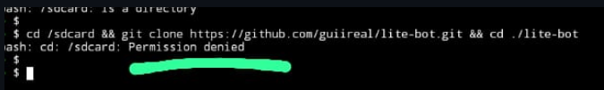

Abra o termux, digite `termux-setup-storage` e depois, aceite as permissões

### ⚙️ Você configura o token da Spider API, prefixo, etc e o bot não reconhece

Verifique se você não tem dois Takeshi's rodando no seu celular, muitas pessoas baixam o zip e seguem o tutorial, porém, **o tutorial não explica pelo zip, e sim, pelo git clone**.

Geralmente as pessoas que cometem esse erro, ficam com dois bots:

1. O primeiro dentro da `/sdcard`
2. O segundo na pasta `/storage/emulated/0/Download`, que no zip fica como `takeshi-bot-main`

Você deve apagar um dos bots e tanto configurar quanto executar **apenas um**

## Inscreva-se no canal!

<a href="https://www.youtube.com/@devgui_?sub_confirmation=1" target="_blank" rel="noopener noreferrer"></a>

## Contribuindo com o projeto

O Takeshi Bot é um projeto **open source** e sua contribuição é muito bem-vinda! 

### 🚀 Como contribuir

- 🐛 **Reportar bugs** através das [Issues](https://github.com/guiireal/takeshi-bot/issues)
- ✨ **Sugerir novas funcionalidades** 
- 🔧 **Contribuir com código** (novos comandos, correções, melhorias)
- ⭐ **Dar uma estrela** no repositório

### 📖 Antes de contribuir

1. Leia nosso **[Guia de Contribuição](CONTRIBUTING.md)** completo
2. Verifique as [Issues abertas](https://github.com/guiireal/takeshi-bot/issues) 
3. Siga o template obrigatório para Pull Requests

## Licença

[GPL-3.0](https://github.com/guiireal/takeshi-bot/blob/main/LICENSE)

Este projeto está licenciado sob a Licença Pública Geral GNU (GPL-3.0).<br/>
Isso significa que:

- Você pode usar este código como quiser, seja para projetos pessoais ou comerciais.
- Você pode modificar o código para adaptá-lo às suas necessidades.
- Você pode compartilhar ou vender o código, mesmo modificado, mas precisa:
    - Manter os créditos ao autor original (Guilherme França - Dev Gui).
    - Tornar o código modificado disponível sob a mesma licença GPL-3.0.

O que você não pode fazer:

- Não pode transformar este código em algo proprietário (fechado) e impedir outras pessoas de acessá-lo ou usá-lo.

Esta licença garante que todos tenham acesso ao código-fonte e podem colaborar livremente, promovendo o compartilhamento e o aprimoramento do projeto.

## ⚠ Disclaimer

Neste projeto, precisei hospedar a node_modules, para auxiliar quem está rodando o bot pelo celular, pois muitos deles podem não rodar o `npm install` pelo termux corretamente.
